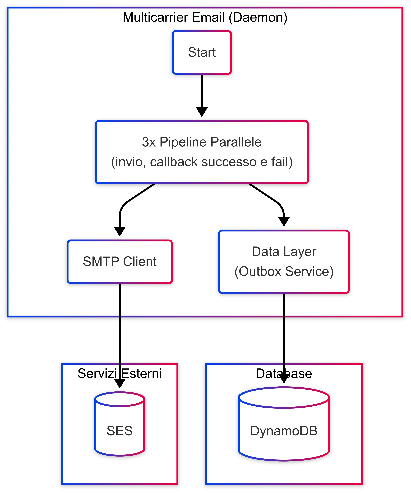

# Architettura Generale

## Panoramica
Il Mailculator Processor è un'applicazione scritta in Go che elabora email attraverso pipeline parallele utilizzando MySQL come storage principale.

## Componenti Principali

### Application Layer
- **Main Application** (`cmd/main/main.go`): Punto di ingresso che inizializza e avvia tutte le pipeline
- **App Core** (`internal/app/app.go`): Gestisce l'esecuzione parallela delle pipeline e del server health check
- **Health Check Server** (`internal/healthcheck/healthcheck.go`): Server HTTP per monitoraggio dello stato dell'applicazione

### Pipeline Layer
- **Pipeline Interface** (`internal/pipeline/interface.go`): Contratto comune per tutte le pipeline
- **MainSenderPipeline** (`internal/pipeline/sender.go`): Gestisce l'invio degli email
- **SentCallbackPipeline** (`internal/pipeline/callback.go`): Gestisce i callback per email inviati
- **FailedCallbackPipeline** (`internal/pipeline/callback.go`): Gestisce i callback per email falliti

### Data Layer
- **MySQL Outbox** (`internal/outbox/outbox.go`): Gestione degli email e degli stati su MySQL
- **SMTP Client** (`internal/smtp/client.go`): Client per invio email tramite SMTP

### Configuration Layer
- **Config Management** (`internal/config/config.go`): Caricamento e validazione della configurazione da YAML con espansione variabili d'ambiente

## Infrastruttura AWS

### Compute
- **ECS Fargate**: Esecuzione dei container
- **Task Definition**: Definita tramite CDK con container principale e Datadog sidecar

### Storage
- **MySQL (RDS/MariaDB)**: Database principale per metadati degli email
- **EFS**: Storage per payload e allegati (filesystem condiviso)

### Networking & Security
- **Secrets Manager**: Gestione credenziali SMTP
- **SSM Parameter Store**: Configurazione parametri infrastrutturali
- **IAM Roles**: Permessi specifici per ECS tasks

### Monitoring
- **CloudWatch Logs**: Logging centralizzato
- **Datadog Agent**: Monitoring e metriche applicative

## Dipendenze Esterne
- YAML parser (gopkg.in/yaml.v3)
- Validator (go-playground/validator/v10)
