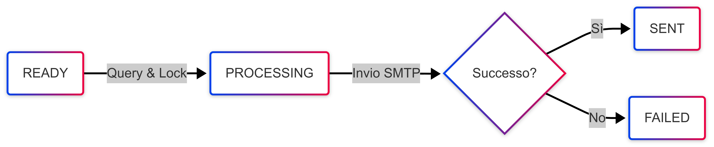
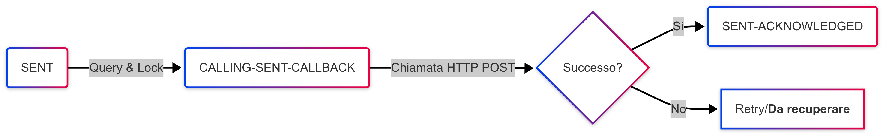
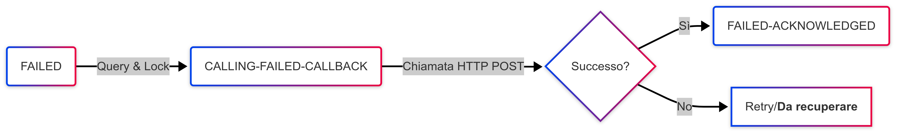

# Pipeline Parallele del Mailculator Processor

## Panoramica
Il sistema esegue quattro pipeline parallele che elaborano gli email attraverso diversi stati del ciclo di vita, utilizzando MySQL come storage e un client SMTP per l'invio diretto.

## Stati degli Email
- **ACCEPTED**: Email accettato, in attesa di intake
- **INTAKING**: Email in fase di elaborazione intake
- **READY**: Email pronto per l'invio
- **PROCESSING**: Email in fase di elaborazione per l'invio
- **SENT**: Email inviato con successo
- **FAILED**: Invio email fallito
- **INVALID**: Intake email fallito
- **CALLING-SENT-CALLBACK**: In corso chiamata callback per email inviato
- **CALLING-FAILED-CALLBACK**: In corso chiamata callback per email fallito
- **SENT-ACKNOWLEDGED**: Callback per email inviato completato
- **FAILED-ACKNOWLEDGED**: Callback per email fallito completato

## Pipeline 1: IntakePipeline (Intake Email)
Questa pipeline elabora gli email dallo stato ACCEPTED.

1. **Query**: Recupera fino a 25 email con stato "ACCEPTED"
2. **Elaborazione parallela**: Per ogni email trovato:
   - Aggiorna lo stato a "INTAKING" (lock di elaborazione)
   - Legge il file JSON dal percorso specificato in `PayloadFilePath`
   - Valida il payload JSON (verifica campi richiesti e formati)
   - In caso di successo: aggiorna stato a "READY"
   - In caso di fallimento: aggiorna stato a "INVALID" con motivo errore
3. **Ciclo**: Si ripete ogni intervallo configurato

### Formato Payload JSON
```json
{
  "id": "550e8400-e29b-41d4-a716-446655440000",
  "from": "sender@example.com",
  "reply_to": "reply@example.com",
  "to": "recipient@example.com",
  "subject": "Oggetto Email",
  "body_html": "<html><body>Contenuto HTML</body></html>",
  "body_text": "Contenuto testo",
  "attachments": ["file:///path/to/attachment1.pdf"],
  "custom_headers": {
    "X-Custom-Header": "Value"
  }
}
```

## Pipeline 2: MainSenderPipeline (Invio Email)
Questa pipeline elabora gli email dallo stato READY.



1. **Query**: Recupera fino a 25 email con stato "READY"
2. **Elaborazione parallela**: Per ogni email trovato:
   - Aggiorna lo stato a "PROCESSING" (lock di elaborazione)
   - Legge il payload JSON e costruisce il messaggio MIME in memoria
   - Tenta l'invio tramite client SMTP (net/smtp)
   - In caso di successo: aggiorna stato a "SENT"
   - In caso di fallimento: aggiorna stato a "FAILED" con motivo errore
3. **Ciclo**: Si ripete ogni intervallo configurato

## Pipeline 3: SentCallbackPipeline (Callback Email Inviati)
Questa pipeline elabora gli email dallo stato SENT.



1. **Query**: Recupera fino a 25 email con stato "SENT"
2. **Elaborazione parallela**: Per ogni email trovato:
   - Aggiorna lo stato a "CALLING-SENT-CALLBACK" (lock di elaborazione)
   - Prepara payload JSON con:
     - code: "TRAVELING"
     - reached_at: timestamp di aggiornamento
     - message_ids: array con ID email
     - reason: "Consegnato al server di posta"
   - Invia richiesta HTTP POST all'URL configurato
   - La richiesta HTTP usa un timeout di 10 secondi
   - Gestisce retry in caso di status 409 (CONFLICT) fino a MaxRetries
   - In caso di successo HTTP 200: aggiorna stato a "SENT-ACKNOWLEDGED"
3. **Ciclo**: Si ripete ogni intervallo configurato

## Pipeline 4: FailedCallbackPipeline (Callback Email Falliti)
Questa pipeline elabora gli email dallo stato FAILED.



1. **Query**: Recupera fino a 25 email con stato "FAILED"
2. **Elaborazione parallela**: Per ogni email trovato:
   - Aggiorna lo stato a "CALLING-FAILED-CALLBACK" (lock di elaborazione)
   - Prepara payload JSON con:
     - code: "DISPATCH-ERROR"
     - reached_at: timestamp di aggiornamento
     - message_ids: array con ID email
     - reason: motivo dell'errore originale
   - Invia richiesta HTTP POST all'URL configurato
   - La richiesta HTTP usa un timeout di 10 secondi
   - Gestisce retry in caso di status 409 (CONFLICT) fino a MaxRetries
   - In caso di successo HTTP 200: aggiorna stato a "FAILED-ACKNOWLEDGED"
3. **Ciclo**: Si ripete ogni intervallo configurato

## Esecuzione Parallela
Le quattro pipeline vengono eseguite contemporaneamente in goroutine separate, ciascuna con il proprio ciclo di polling che si attiva ogni N secondi (configurabile). Un health check server rimane attivo per monitorare lo stato del sistema.
